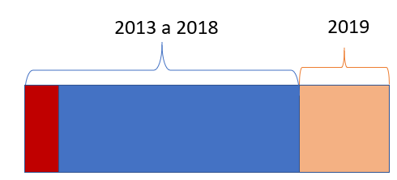
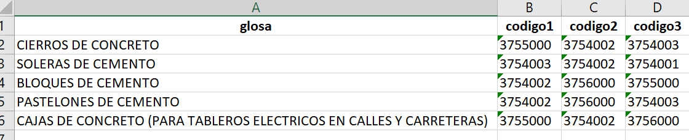

class: center, middle

.linea-superior[]
.linea-inferior[]


## Codificación automática de textos 

## Primera presentación de resultados

## Proyecto Estratégico de Servicios Compartidos

### Marzo 2021


```{r setup, include=FALSE}
options(htmltools.dir.version = FALSE, scipen = "999")
knitr::opts_chunk$set(message = FALSE, echo = FALSE, fig.align="center", warning = FALSE) 
```

```{r xaringan-themer, include=FALSE, warning=FALSE}
library(xaringanthemer)
#style_duo_accent(
 # primary_color = "#1381B0",
  #secondary_color = "#FF961C",
  #inverse_header_color = "#FFFFFF"
#)
```


---
background-image: url("imagenes/fondo2.PNG")
background-size: contain;
background-position: 100% 0%

# Objetivos de la presentación

Revisar características de los datos 

--

Descripción del ejercicio realizado

--

Revisión de principales resultados

--

Abordar algunas propuestas e ideas

---
background-image: url("imagenes/fondo2.PNG")
background-size: contain;
background-position: 100% 0%

# Descripción de los datos

Estamos usando datos de la ENIA desde **2013 a 2019**

--

En el dataset inicial existen registros **duplicados**, con **valores NA** (cpc y glosa) o **códigos inexistentes**

```{r}
library(readr);library(tidyverse);library(readxl);library(kableExtra);library(feather)

# Cargar datos enia
enia <-  read_csv("data/ENIA_CPC.csv")
names(enia) <- tolower(names(enia))

# Cargar datos del clasificador cpc
clasificador <- read_excel("data/CPC_ciiu.xlsx")
names(clasificador) <- tolower(names(clasificador))

# Eliminar valores repetidos, inexistentes o con NA
unicos <- enia %>% 
  filter(!is.na(cpc) & !is.na(glosa)) %>% 
  distinct() %>% 
  mutate(cpc = as.character(cpc)) %>% 
  inner_join(clasificador, by = "cpc")

# Formato de la tabla
filas <- data.frame(inicial = nrow(enia), filtrado =  nrow(unicos) ) %>% 
  mutate_all(  ~formatC( . , format="fg", big.mark = ".", decimal.mark = ","))

# Tabla con filas antes y después
kbl(filas, align = "c") %>% 
   kable_styling(bootstrap_options = c("striped", "hover"), position = "center")

# Número de categorías
n_clases <- formatC( length(unique(unicos$cpc)) , format="fg", big.mark = ".", decimal.mark = ",") 


```


--

Existe un total de **`r n_clases`** categorías

--

```{r, fig.height=4.5, fig.width=8}
unicos %>% 
  count(cpc) %>% 
  filter(n > 8) %>% 
  ggplot(aes(x = cpc, y = n)) +
  geom_bar(stat = "identity") + 
  labs(title = "Distribución de las clases",
       subtitle = "Clases con frecuencia mayor a 8") +
  theme(axis.text.x = element_blank(),
        axis.title.x = element_blank(),
        axis.ticks.x  = element_blank(),
        plot.title = element_text(hjust = 0.5),
        plot.subtitle = element_text(hjust = 0.5), text = element_text(size = 14))
```

---
background-image: url("imagenes/fondo2.PNG")
background-size: contain;
background-position: 100% 0%

# Descripción de los datos

```{r}
# Descriptivos de las frecuencias
resumen <- unicos %>% 
  count(cpc) %>% 
  summarise(min = min(n),
            max = max(n),
            media = mean(n),
            q25 = quantile(n, probs = 0.25),
            mediana = median(n),
            q75 = quantile(n, probs = 0.75)) %>% 
  mutate_all(~formatC( . , format="fg", big.mark = ".", decimal.mark = ","))
  
# Número de categorías con un registro
solo_uno <- unicos %>% 
  group_by(cpc) %>% 
  filter(n() == 1) %>% 
  nrow(.)


kbl(resumen, align = "c") %>% 
   kable_styling(bootstrap_options = c("striped", "hover"), position = "center")

  

```

El **25%** de las categorías tiene menos de `r resumen$q25` apariciones

Existen **`r solo_uno`** categorías que solo tienen una aparición

--

Las clases con solo una aparición fueron removidas


```{r}
restantes <- unicos %>% 
  group_by(cpc) %>% 
  mutate(contar = n()) %>% 
  ungroup() %>% 
  filter(contar > 1) %>% 
  nrow()

tabla_filas <- data.frame(filas, final = restantes) %>% 
  mutate_all(~formatC( . , format="fg", big.mark = ".", decimal.mark = ","))


kbl(tabla_filas, align = "c") %>% 
   kable_styling(bootstrap_options = c("striped", "hover"), position = "center")


```
--

```{r}
clases_final <- unicos %>% 
  group_by(cpc) %>% 
  mutate(contar = n()) %>% 
  ungroup() %>% 
  filter(contar > 1) %>% 
  distinct(cpc) %>% 
  nrow()

```


Número final de clases es **`r clases_final`** 

---
background-image: url("imagenes/fondo2.PNG")
background-size: contain;
background-position: 100% 0%

# Evaluación general del dataset

- **Balance**: muy desbalanceado
- **Número de clases**: muy alto
- **Tamaño de la base**: mediano

--

### Es un problema de clasificación complejo

--
**Aspectos positivos**

- Textos bastante estructurados
- Repetición en el tiempo


---
background-image: url("imagenes/fondo2.PNG")
background-size: contain;
background-position: 100% 0%

# Descripción del ejercicio

```{r}

filtrado <- unicos %>% 
  group_by(cpc) %>% 
  mutate(contar = n()) %>% 
  ungroup() %>% 
  filter(contar > 1) 

train <- filtrado %>%
  filter(periodo <= 2018) 

test <- filtrado %>% 
  filter(periodo == 2019)


particion <-  data.frame(train = nrow(train), test = nrow(test)) %>% 
  mutate_all(~formatC( . , format="fg", big.mark = ".", decimal.mark = ",")) %>%
  pivot_longer(cols = c(train, test), names_to = "conjunto", values_to = "cantidad") %>% 
  mutate(fecha = if_else(conjunto == "train", "2013-2018", "2019")) %>% 
  relocate(fecha, .after = conjunto)
  
kbl(particion, align = "c") %>% 
   kable_styling(bootstrap_options = c("striped", "hover"), position = "center")

```

.center[

]


--

Variables utilizadas

- glosa

- rol de la empresa


--

Algoritmo

- red neuronal de capa profunda (*deep learning*)

---

background-image: url("imagenes/fondo2.PNG")
background-size: contain;
background-position: 100% 0%

# Resultados

```{r}
# Cargar resultados en R sin tfidf en el set de testeo
resultados <- read_feather("data/pred_red_cpc.feather")

acc <- resultados %>% 
  mutate(coincide = if_else(codigo1 == real, 1, 0)) %>% 
  count(coincide) %>% 
  mutate(porcentaje = n / sum(n) * 100,
         coincide = if_else(coincide == 0, "No", "Sí"))
  
ggplot(acc, aes(x = coincide, y = round(porcentaje), fill = coincide)) +
  geom_bar(stat = "identity") +
  geom_text(aes(label= round(porcentaje, 1)), 
             position=position_dodge(width=0.9), 
             vjust=-0.25) +
  labs(title = "Porcentaje de acierto cpc (7 dígitos)",
       y = "porcentaje") +
  theme(plot.title = element_text( hjust = 0.5, size = 18),
        axis.title.x = element_blank())


```

---

background-image: url("imagenes/fondo2.PNG")
background-size: contain;
background-position: 100% 0%

# Resultados

### ¿Y si selecciono los 3 códigos más probables?

.center[

]

--

La predicción de un algoritmo es una distribución de probabilidades

--

```{r, fig.height=4}
prob <- resultados %>% 
  slice(10) %>% 
  select(starts_with("V") ) %>% 
  mutate_at(vars(starts_with("V")),  ~.*100) %>% 
  pivot_longer(cols = starts_with("V"), 
               names_to = "x",
               values_to = "probabilidad") %>% 
  select(probabilidad)

codes <- resultados %>% 
  slice(10) %>% 
  select(starts_with("codigo") ) %>% 
  pivot_longer(cols = everything(), 
               names_to = "tipo",
               values_to = "codigo") %>% 
  select(codigo)

ejemplo <-  bind_cols(prob, codes)
ejemplo %>% 
  ggplot(aes(x = reorder(codigo, desc(probabilidad)), y = probabilidad, fill = codigo)) +
  geom_bar(stat = "identity") +
  geom_text(aes(label= round(probabilidad, 1)), 
             position=position_dodge(width=0.9), 
             vjust=-0.25) +
  labs(title =  resultados$glosa[10]) +
  theme(plot.title = element_text( hjust = 0.5, size = 18),
        axis.title.x = element_blank())

```

A cada código se le asigna una probabildiad


---
background-image: url("imagenes/fondo2.PNG")
background-size: contain;
background-position: 100% 0%

# Resultados


```{r, fig.width=8, fig.height=6 }
acierto3 <- resultados %>% 
  count(coincide3) %>% 
  mutate(porcentaje = n / sum(n) * 100,
         tipo = "3 primeros") %>% 
  rename(coincide = coincide3)

acierto4 <- resultados %>% 
  count(coincide4) %>% 
  mutate(porcentaje = n / sum(n) * 100,
         tipo = "4 primeros") %>% 
  rename(coincide = coincide4)

tabla_aciertos <- bind_rows(acierto3, acierto4) %>% 
  mutate(coincide = if_else(coincide == 0, "no acierto", "acierto"))

tabla_aciertos %>% 
  ggplot(aes(x = tipo, y = porcentaje, fill = coincide)) +
  geom_bar(stat = "identity", position = "dodge") +
  geom_text(aes(label= round(porcentaje, 1)), 
             position=position_dodge(width=0.9), 
             vjust=-0.25) +
  labs(title =  "Porcentaje de acierto de la red",
       subtitle = "Considerando 3 o 4 códigos más probables" ) +
  theme(plot.title = element_text( hjust = 0.5, size = 18),
        plot.subtitle = element_text( hjust = 0.5, size = 16),
        axis.title.x = element_blank())

```

---
background-image: url("imagenes/fondo2.PNG")
background-size: contain;
background-position: 100% 0%

# Propuestas

Podemos usar las probabilidades y confiar en las predicciones que tienen mayor certidumbre

--

```{r}

source("helpers_analisis.R")


resultados2 <- resultados %>% 
  mutate(prob_max = V1,
         predicho = codigo1)


cortes <- map(c(seq(0, 0.98, 0.02), seq(0.98, 0.999, 0.001)), ~cortar_evaluar(.x, resultados2) %>% 
      mutate(corte = .x)) %>% 
  reduce(bind_rows) %>% 
  mutate(porcentaje_auto = total / completa,
         porcentaje_error = 1 - por_acierto,
         porcentaje_manual = 1 - porcentaje_auto)
  
# Graficar relación entre error y porcentaje codificado automáticamente
cortes %>% 
  ggplot(aes(x = porcentaje_manual * 100, y = porcentaje_error * 100  )) +
  geom_line() +
  #geom_point() +
  annotate("text", x = 40, y = 14, label = "Aproximadamente\n3% de error", color = "red") +
  geom_vline(xintercept = 50, color = "red", linetype = "dashed") +
  scale_x_continuous(breaks = seq(0, 90, 5)) +
  scale_y_continuous(breaks = seq(0, 20, 1)) +
  labs(title =  "Relación entre codificación manual y error",
       subtitle = "7 dígitos",
       y = "% de error", 
       x = "% codificado manualmente") +
  theme(plot.title = element_text( hjust = 0.5, size = 18),
        plot.subtitle =  element_text(hjust = 0.5,  size = 16))
```

---
background-image: url("imagenes/fondo2.PNG")
background-size: contain;
background-position: 100% 0%

# Propuestas

Sugerir códigos en una planilla excel 

--

.center[

]

--

Esto tendría que estar acompañado de una capacitación


---
background-image: url("imagenes/fondo2.PNG")
background-size: contain;
background-position: 100% 0%

# Propuestas

Aplicación que ayude a consultar dudas a los analistas

--

Aplicación que permita subir datos y devuelva todo codificado

--

<br>
<br>

.center[
## Veamos una maqueta de aplicación
]

--


---
background-image: url("imagenes/fondo2.PNG")
background-size: contain;
background-position: 100% 0%

# Próximos pasos

Modelo más complejo (BERT) para intentar mejorar el rendimiento

--

Intentar acercanos al 90% de acierto 

--

### Diseño colaborativo de un producto para las encuestas económicas  

.center[

]

---

class: center, middle

.linea-superior[]
.linea-inferior[]


## Codificación automática de textos 

## Primera presentación de resultados ENIA

## Proyecto Estratégico de Servicios Compartidos

### Marzo 2021

